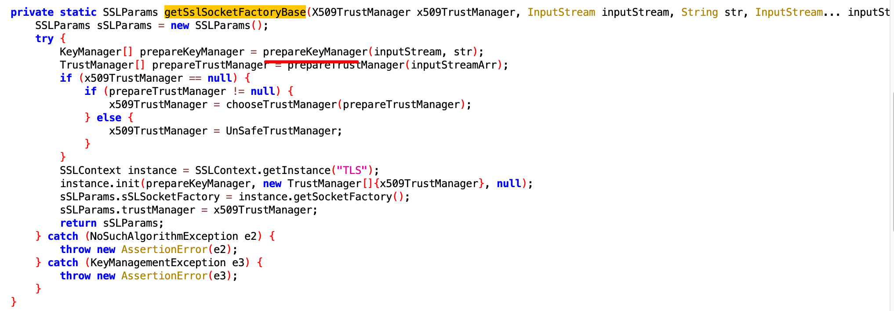
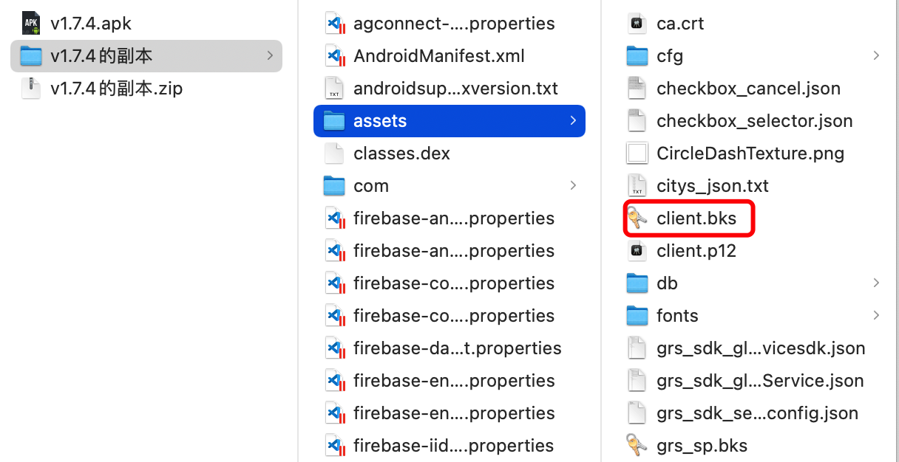
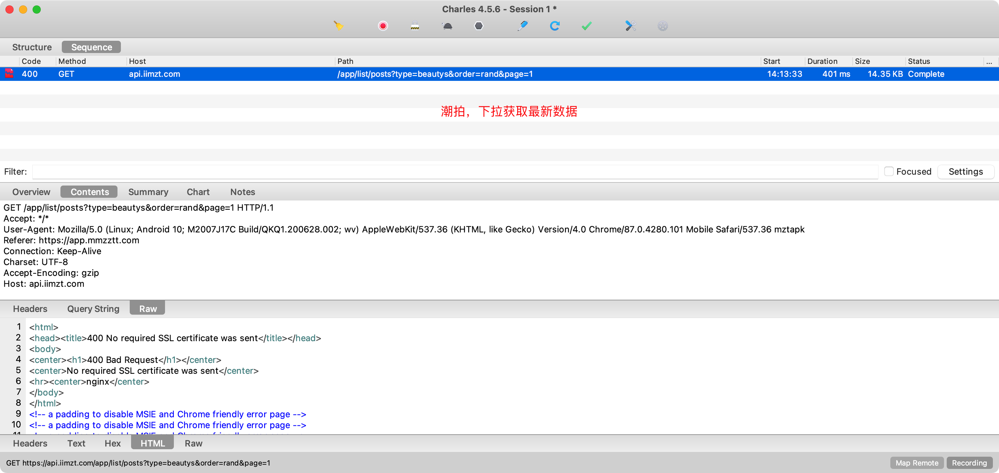
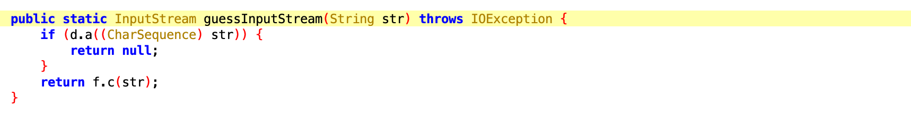

# 服务端证书校验

- 客户端校验

  ```
  - 在客户端中预设证书信息
  - 客户端向服务端发送请求，将服务端返回的证书信息（公钥）和客户端预设证书信息进行校验
  ```

- 服务端校验

  ```
  - 在客户端预设证书（p12/bks）
  - 客户端向服务端发送请求时，携带证书信息，在服务端会校验客户端携带过来证书的合法性
  ```

# 1.一波逆向案例

## 1.1 泡泡聊天

版本：v1.7.4

下载：https://www.wandoujia.com/apps/8280413


### 1.1.1 校验逻辑

服务端证书的校验逻辑：

- 在apk打包时，将证书 bks 或 p12 格式的证书保存在 assets 或 raw 等目录。

- 安卓代码，发送请求时 【读取证书文件内容】+ 【证书密码】

  

  

**逆向时**，需要实现：

- 获取 bks 或 p12证书 文件
- 获取证书相关密码
- 将证书导入到charles，可以实现抓包（bks格式需要转换p12格式）
- 用requests发送请求时，携带证书去发送请求

### 1.1.2 Hook密码

```javascript
Java.perform(function () {
    var KeyStore = Java.use("java.security.KeyStore");

    KeyStore.load.overload('java.io.InputStream', '[C').implementation = function (v1, v2) {
        var pwd = Java.use("java.lang.String").$new(v2);  // 实例化java对象
        console.log('\n------------')
        console.log("类型：" + this.getType());
        console.log("密码：" + pwd);
        console.log(JSON.stringify(v1));  // 看证书目录是assests还是raw
        // 输出调用栈 可以用这种找证书
        //console.log(Java.use("android.util.Log").getStackTraceString(Java.use("java.lang.Throwable").$new()));
        var res = this.load(v1, v2);
        return res;
    };
});
// frida -U -f com.paopaotalk.im -l 1.hook_password.js
// 111111
```

### 1.1.3 Hook证书文件

**有些时候会把后缀名给改了，改成json/txt啥的，这时就不好找了。可以直接导出证书解决**

在开发时，是将证书文件加载到 `InputStream` 对象中，后续发送请求是会携带。。。

而我们想要获取证书可有两种方式：

- 定位代码，找到加载证书的文件路径，然后去apk中寻找。

- 直接Hook证书加载位置，将证书的内容从`InputStream`写入到自定义文件，实现自动导出【更加通用，甚至都不需要任何逆向】。

  注意：手机要对当前APP开启本地硬盘操作权限。

#### 法一：定位代码(麻烦)

- Hook `KeyStore.load` 输出调用栈，寻找证书的位置。

  ```
  ...就在上面
  ```

- app是有壳，需要先试用 `frida-dexdump`进行脱壳，然后反编译。

  ```
  frida-dexdump  -U -f com.paopaotalk.im
  ```

  全部拖入jadx中是空的，这是因为有几个是空的，会导致反编译中断。一个一个的拖进去，直接把反编译出空白的文件删了 v

- 定位代码位置

  

  

  
  

所以，证书的位置 在apk的assets目录下 `client.bks` 且密码阿是 `111111`



#### 法二：直接frida脚本导出证书

注意：在手机上一定要先给当前app开启可以操作硬盘的权限，否则无法导出证书文件。**在设置权限打开读写存储**

```javascript
Java.perform(function () {
    var KeyStore = Java.use("java.security.KeyStore");
    var String = Java.use("java.lang.String");


    KeyStore.load.overload('java.io.InputStream', '[C').implementation = function (inputStream, v2) {
        var pwd = String.$new(v2);
        console.log('\n------------')
        console.log("密码：" + pwd, this.getType());

        if (this.getType() === "BKS") { // 根据证书类型修改，P12的改成P12
            var myArray = new Array(1024);
            for (var i = 0; i < myArray.length; i++) {
                myArray[i] = 0x0;
            }
            // 字节数组 默认1024字节
            var buffer = Java.array('byte', myArray);
		   // 创建个文件
            var file = Java.use("java.io.File").$new("/sdcard/Download/paopao-" + new Date().getTime() + ".bks");// P12记得改后缀
            // 创建输出流 与文件关联
            var out = Java.use("java.io.FileOutputStream").$new(file);
            var r;
            while ((r = inputStream.read(buffer)) > 0) {
                out.write(buffer, 0, r);  // 通过输出流将内容写入文件
            }
            console.log("save success!")
            out.close()
        }

        var res = this.load(inputStream, v2);
        return res;
    };
    
});

// frida -U -f com.paopaotalk.im -l 2.hook_save.js
```

### 1.1.4 转换bks到p12

charles不支持导入bks格式的证书，如果逆向过程中得到了bks格式证书，需要使用 `portecle` 将bks证书转化弄成p12格式，然后再处理。

提示：此工具依赖jdk，请务必先在自己电脑上安装jdk。

打开portecle，并导入bks证书。


提示：也可以使用 https://keystore-explorer.org/downloads.html 来做证书的转换（我的mac不太好用）。

### 1.1.5 charles导入证书

将p12证书导入charles，然后再转抓包就可以了。


再次抓包，成功了。


### 1.1.6 Python请求

如果是服务端证书校验，需要携带证书才能访问。

#### 1.requests_pkcs12

这是最简便的方式，推荐

```python
pip install requests-pkcs12
```

```python
from requests_pkcs12 import get, post

res = post(
    url='https://8.218.94.100:48837/userservices/v2/user/login',
    json={
        "device_type": "app",
        "username": "008615131255555",
        "password": "a2c62dffccea2f1d638aa3945be8770c",
        "device_id": "1d40d48517776215104989bd5949fb91",
        "device_name": "Xiaomi M2007J17C",
        "device_model": "M2007J17C"
    },
    headers={
        "bundle_id": "com.paopaotalk.im",
        "version": "1.7.4",
        "timestamp": "1600",
        "sign": "94703ac3c05a8a5380010cc90890c72b",
        "app_id": "qiyunxin",
        "Accept-Language": "zh-CN",
        "package": "com.paopaotalk.im",
    },
    pkcs12_filename='Client1.p12',
    pkcs12_password='111111',
    verify=False
)
print(res.text)
```

#### 2.requests

默认requests不支持直接使用p12格式的证书，所以需要将p12转换成pem才可以。

```
>>>openssl pkcs12 -in Client1.p12 -out demo.pem -nodes -passin 'pass:111111'
```

```python
from requests import post

res = post(
    url='https://8.218.94.100:48837/userservices/v2/user/login',
    json={
        "device_type": "app",
        "username": "008615131255555",
        "password": "a2c62dffccea2f1d638aa3945be8770c",
        "device_id": "1d40d48517776215104989bd5949fb91",
        "device_name": "Xiaomi M2007J17C",
        "device_model": "M2007J17C"
    },
    headers={
        "bundle_id": "com.paopaotalk.im",
        "version": "1.7.4",
        "timestamp": "1600",
        "sign": "94703ac3c05a8a5380010cc90890c72b",
        "app_id": "qiyunxin",
        "Accept-Language": "zh-CN",
        "package": "com.paopaotalk.im",
    },
    cert='demo.pem',
    verify=False
)
print(res.text)
```

## 1.2 美之图

版本：v3.5.3 （apk文件见课件）

**注意**：请不要晚上逆向这个app，有点伤身体（无不良引导，实在是案例少）。



### 1.2.1 校验逻辑

服务端证书的校验逻辑：

- 在apk打包时，将证书 bks 或 p12 格式的证书保存在 assets 或 raw 等目录。

- 安卓代码，发送请求时 【读取证书文件内容】+ 【证书密码】

  

  

**逆向时**，需要实现：

- 获取 bks 或 p12证书 文件
- 获取证书相关密码
- 将证书导入到charles，可以实现抓包（bks格式需要转换p12格式）
- 用requests发送请求时，携带证书去发送请求

### 1.2.2 Hook密码

```javascript
Java.perform(function () {
    var KeyStore = Java.use("java.security.KeyStore");

    KeyStore.load.overload('java.io.InputStream', '[C').implementation = function (v1, v2) {
        var pwd = Java.use("java.lang.String").$new(v2);
        console.log('\n------------')
        console.log("类型：" + this.getType());
        console.log("密码：" + pwd);
        console.log(JSON.stringify(v1));
        //console.log(Java.use("android.util.Log").getStackTraceString(Java.use("java.lang.Throwable").$new()));
        var res = this.load(v1, v2);
        return res;
    };
});
// frida -U -f com.mmzztt.app -l 1.hook_password.js
// uX39!dd$#rr_XIyb%
```

输出

```
类型：pkcs12
密码：uX39!dd$#rr_XIyb%
"<instance: java.io.InputStream, $className: android.content.res.AssetManager$AssetInputStream
>"
```

猜测是在asset这个目录下有证书，结果没找到后缀名是pks的文件，因为它改了后缀

### 1.2.3 Hook证书文件

在开发时，是将证书文件加载到 `InputStream` 对象中，后续发送请求是会携带。。。

而我们想要获取证书可有两种方式：

- 定位代码，找到加载证书的文件路径，然后去apk中寻找。

- 直接Hook证书加载位置，将证书的内容从`InputStream`写入到自定义文件，实现自动导出【更加通用，甚至都不需要任何逆向】。

  注意：手机要对当前APP开启本地硬盘操作权限。

#### 法一：定位代码

- Hook `KeyStore.load` 输出调用栈，寻找证书的位置。

  ```
  java.lang.Throwable
          at java.security.KeyStore.load(Native Method)
          at com.deepe.c.j.c.b.b(Unknown Source:32)
          at com.deepe.c.j.c.b.a(Unknown Source:39)
          at com.deepe.c.j.e.d.getSslSocketFactory(Unknown Source:20)
          at com.deepe.c.j.d.g.a(Unknown Source:42)
          at com.deepe.c.j.d.g.a(Unknown Source:120)
          at com.deepe.c.j.d.a.a(Unknown Source:33)
          at com.deepe.c.j.h.run(Unknown Source:69)
  ```

- app是有壳，需要先试用 `frida-dexdump`进行脱壳，然后反编译。

  ```
  frida-dexdump  -U -f com.mmzztt.app
  ```

- 定位代码位置
  

  

  

  再结合Hook脚本，就能确定其实是读取本地的 `config`文件，其实就是p12证书。
  **注意**：因为有壳，所以Hook相关代码时需要延迟下。

  

  ```javascript
  Java.perform(function () {
      var KeyStore = Java.use("java.security.KeyStore");
      var String = Java.use("java.lang.String");
  
      // 系统包不需要延迟
      KeyStore.getInstance.overload('java.lang.String').implementation = function (name) {
          //console.log("秘钥格式:", name);
          return this.getInstance(name);
      }
      KeyStore.load.overload('java.io.InputStream', '[C').implementation = function (v1, v2) {
          var pwd = String.$new(v2);
          console.log("密码：" + pwd);
          // console.log(Java.use("android.util.Log").getStackTraceString(Java.use("java.lang.Throwable").$new()));
          var res = this.load(v1, v2);
          return res;
      };
  
      setTimeout(function (){
  
          var b = Java.use("com.deepe.c.j.c.b");
          b.b.implementation = function (str,str2) {
              console.log(str,str2);
              return this.b(str,str2);
          }
  
          var UZUtility = Java.use("com.uzmap.pkg.uzkit.UZUtility");
          UZUtility.guessInputStream.implementation = function (str) {
              console.log(str);
              return this.guessInputStream(str);
          }
  
          var f = Java.use("com.deepe.c.i.f");
          f.a.overload('java.lang.String', 'java.io.InputStream').implementation = function (str,stream) {
              console.log(str,stream);
              return this.a(str,stream);
          }
      },1000);  // 延迟hook 等待方法都加载到内存
  
  });
  
  // frida -U -f com.mmzztt.app -l 2.hook.js
  // uX39!dd$#rr_XIyb%
  ```


#### 法二：导出证书

注意：在手机上一定要先给当前app开启可以操作硬盘的权限，否则无法导出证书文件。

```javascript
Java.perform(function () {
    var KeyStore = Java.use("java.security.KeyStore");
    var String = Java.use("java.lang.String");


    KeyStore.load.overload('java.io.InputStream', '[C').implementation = function (inputStream, v2) {
        var pwd = String.$new(v2);
        console.log('\n------------')
        console.log("密码：" + pwd, this.getType());

        if (this.getType() === "PKCS12") {
            var myArray = new Array(1024);
            for (var i = 0; i < myArray.length; i++) {
                myArray[i] = 0x0;
            }
            var buffer = Java.array('byte', myArray);

            var file = Java.use("java.io.File").$new("/sdcard/Download/meizhitu-" + new Date().getTime() + ".bks");
            var out = Java.use("java.io.FileOutputStream").$new(file);
            var r;
            while ((r = inputStream.read(buffer)) > 0) {
                out.write(buffer, 0, r);
            }
            console.log("save success!")
            out.close()
        }

        var res = this.load(inputStream, v2);
        return res;
    };
    
});

// frida -U -f com.mmzztt.app -l 2.hook_save.js
```

### 1.2.4 charles导入证书

同上

### 1.2.5 python请求

requests 发送请求携带证书

同上 1.1.6

# 2.自定义证书开发

上面是站在逆向的角度进行学习。

接下来，站在开发的角度，开发后端API和app实现服务端证书校验。

## 2.1 创建秘钥

### 2.1.1 服务端

- 生成key（RSA的私钥）

  ```
  >>>openssl genrsa -out server-key.key 1024
  ```

- 生成服务端证书请求文件

  ```
  >>>openssl req -new -out server-req.csr -key server-key.key
  ```

  

- 生成服务端证书

  ```
  >>>openssl x509 -req -in server-req.csr -out server-cert.cer -signkey server-key.key  -CAcreateserial -days 3650
  ```

服务端命令执行完成后，会创建如下三个文件：


### 2.1.2 客户端

- 生成客户端key

  ```
  openssl genrsa -out client-key.key 1024
  ```

- 生成客户端证书请求文件

  ```
  openssl req -new -out client-req.csr -key client-key.key
  ```

  

- 生成客户端证书

  ```
  openssl x509 -req -in client-req.csr -out client-cert.cer -signkey client-key.key -CAcreateserial -days 3650
  ```

- 生成客户端带密码的p12证书（可集成在安卓中来实现服务端校验）

  ```
  openssl pkcs12 -export -clcerts -in client-cert.cer -inkey client-key.key -out client.p12
  
  输入密码：qwe888
  ```

### 2.1.3 bks证书

客户端的p12格式证书可以转换为bks格式证书，在安卓中集成bks证书实现服务端校验。

- 下载 `Portecle`

  ```
  https://portecle.sourceforge.net/
  https://sourceforge.net/projects/portecle/
  ```

  

- 启动运行

  ```
  >>>cd ..
  >>>java -jar portecle.jar
  ```

  

- 操作
  

  

  

  

  

  
  

  

  

  

  

- 导出成功

  

## 2.2 服务端API

基于Flask开发Web平台，为安卓提供数据支持。

```
pip install flask
```

### 2.2.1 普通Web

```python
from flask import Flask, jsonify

app = Flask(__name__)


@app.route('/index')
def index():
    return jsonify({"code": 1000, 'data': "success"})


if __name__ == '__main__':
    app.run(host="0.0.0.0", port=80)
```


### 2.2.2 证书校验

**详见示例：api.zip**

```python
import os
import ssl
from flask import Flask, jsonify

app = Flask(__name__)


@app.route('/index')
def index():
    return jsonify({"code": 1000, 'data': "success"})


if __name__ == '__main__':
    server_cer = os.path.join("server", "server-cert.cer")
    server_key = os.path.join("server", "server-key.key")
    client_cer = os.path.join("client", "client-cert.cer")
    # 创建ssl上下文
    ssl_context = ssl.SSLContext(protocol=ssl.PROTOCOL_TLSv1_2)
    # 选择认证模式：作为服务端，此选项为服务端必须校验客户端的证书，双向认证
    ssl_context.verify_mode = ssl.CERT_REQUIRED
    ssl_context.load_verify_locations(client_cer)
    ssl_context.load_cert_chain(certfile=server_cer, keyfile=server_key)

    app.run(host="0.0.0.0", port=443, ssl_context=ssl_context)
```


## 2.3 安卓端（p12）

**详见示例：NetDemoP12.zip**


## 2.4 安卓端（bks）

**详见示例：NetDemoBks.zip**


## 2.5 抓包

### 2.5.1 抓包-代理报错

直接使用charles代理抓包就会报错。


### 2.5.2 抓包-证书导入-p12

将p12证书导入charles，然后再转抓包就可以了。


再次抓包，成功了。


### 2.5.3 抓包-证书导入-bks

charles不支持导入bks格式的证书，如果逆向过程中得到了bks格式证书，需要使用 `portecle` 将bks证书转化弄成p12格式，然后再处理。

#### 1.bks转换p12

打开portecle，并导入bks证书。


注意：也可以使用 https://keystore-explorer.org/downloads.html 来做证书的转换。

#### 2.charles导入

将生成的p12文件导入charles，然后就能抓包了。【同上述p12格式】


# 3.其他

- tracer-keystore.js 脚本

  ```
  https://github.com/WithSecureLabs/android-keystore-audit/blob/master/frida-scripts/tracer-keystore.js
  ```

- 自动导出证书 + 转换p12（请提前为APP设置读取权限）【读写手机存储-始终允许】

  ```javascript
  Java.perform(function () {
      function uuid(len, radix) {
          var chars = '0123456789ABCDEFGHIJKLMNOPQRSTUVWXYZabcdefghijklmnopqrstuvwxyz'.split('');
          var uuid = [], i;
          radix = radix || chars.length;
  
          if (len) {
              // Compact form
              for (i = 0; i < len; i++) uuid[i] = chars[0 | Math.random() * radix];
          } else {
              // rfc4122, version 4 form
              var r;
  
              // rfc4122 requires these characters
              uuid[8] = uuid[13] = uuid[18] = uuid[23] = '-';
              uuid[14] = '4';
  
              // Fill in random data. At i==19 set the high bits of clock sequence as
              // per rfc4122, sec. 4.1.5
              for (i = 0; i < 36; i++) {
                  if (!uuid[i]) {
                      r = 0 | Math.random() * 16;
                      uuid[i] = chars[(i == 19) ? (r & 0x3) | 0x8 : r];
                  }
              }
          }
  
          return uuid.join('');
      }
  
      function storeP12(pri, p7, p12Path, p12Password) {
          var X509Certificate = Java.use("java.security.cert.X509Certificate")
          var p7X509 = Java.cast(p7, X509Certificate);
          var chain = Java.array("java.security.cert.X509Certificate", [p7X509])
          var ks = Java.use("java.security.KeyStore").getInstance("PKCS12", "BC");
          ks.load(null, null);
          ks.setKeyEntry("client", pri, Java.use('java.lang.String').$new(p12Password).toCharArray(), chain);
          try {
              var out = Java.use("java.io.FileOutputStream").$new(p12Path);
              ks.store(out, Java.use('java.lang.String').$new(p12Password).toCharArray())
          } catch (exp) {
              console.log(exp)
          }
      }
  
      //在服务器校验客户端的情形下，帮助dump客户端证书，并保存为p12的格式，证书密码为r0ysue
      Java.use("java.security.KeyStore$PrivateKeyEntry").getPrivateKey.implementation = function () {
          var result = this.getPrivateKey()
          var packageName = Java.use("android.app.ActivityThread").currentApplication().getApplicationContext().getPackageName();
          storeP12(this.getPrivateKey(), this.getCertificate(), '/sdcard/Download/' + packageName + uuid(10, 16) + '.p12', 'r0ysue');
          return result;
      }
  
      Java.use("java.security.KeyStore$PrivateKeyEntry").getCertificateChain.implementation = function () {
          var result = this.getCertificateChain()
          var packageName = Java.use("android.app.ActivityThread").currentApplication().getApplicationContext().getPackageName();
          storeP12(this.getPrivateKey(), this.getCertificate(), '/sdcard/Download/' + packageName + uuid(10, 16) + '.p12', 'r0ysue');
          return result;
      }
  });
  
  // frida -U -f 包 -l p12.js
  ```

- frida-io

  ```
  https://codeshare.frida.re/@ninjadiary/frinja----java-io/
  ```

- str/bytes/base64等转换

  ```
  https://www.jianshu.com/p/8f9be9ccd69f
  ```

