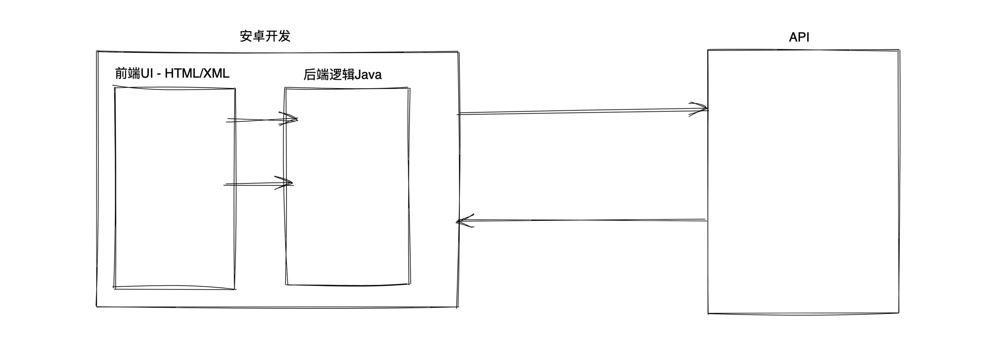
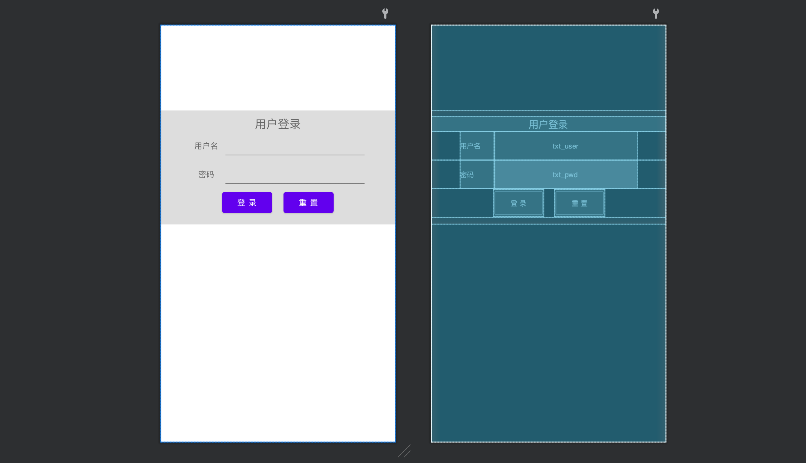

# 安卓开发

今日目标：快速开发一个安卓页面（用户登录&跳转）

概要：

- 安卓UI和后台逻辑
- 网络请求
- 序列化和反序列化
- 保存XML文件（cookie）



## 1.安卓UI和后台逻辑

### 1.1 安卓UI



```xml
<?xml version="1.0" encoding="utf-8"?>
<LinearLayout xmlns:android="http://schemas.android.com/apk/res/android"
    xmlns:app="http://schemas.android.com/apk/res-auto"
    xmlns:tools="http://schemas.android.com/tools"
    android:layout_width="match_parent"
    android:layout_height="match_parent"
    tools:context=".MainActivity">

    
    <LinearLayout
        android:layout_width="match_parent"
        android:layout_height="250dp"
        android:background="#dddddd"
        android:layout_marginTop="150dp"
        android:orientation="vertical">

        <TextView
            android:layout_width="match_parent"
            android:layout_height="wrap_content"
            android:text="用户登录"
            android:textAlignment="center"
            android:textSize="25dp"
            android:layout_marginTop="10dp">

        </TextView>

        <LinearLayout
            android:layout_width="match_parent"
            android:layout_height="60dp"
            android:paddingLeft="15dp"
            android:paddingRight="15dp">
        
            <TextView
                android:layout_width="60dp"
                android:layout_height="match_parent"
                android:text="用户名："
                android:gravity="center">
            </TextView>

            <EditText
                android:layout_width="match_parent"
                android:layout_height="match_parent"
                android:inputType="text"
                android:singleLine="true"
                android:textSize="14dp">

            </EditText>

        </LinearLayout>


        <LinearLayout
            android:layout_width="match_parent"
            android:layout_height="60dp"
            android:paddingLeft="15dp"
            android:paddingRight="15dp">

            <TextView
                android:layout_width="60dp"
                android:layout_height="match_parent"
                android:text="密码："
                android:gravity="center">
            </TextView>

            <EditText
                android:layout_width="match_parent"
                android:layout_height="match_parent"
                android:inputType="textPassword"
                android:singleLine="true"
                android:textSize="14dp">

            </EditText>

        </LinearLayout>

        <LinearLayout
            android:gravity="center"
            android:layout_width="match_parent"
            android:layout_height="60dp">

            <Button
                android:layout_width="wrap_content"
                android:layout_height="wrap_content"
                android:layout_marginRight="10dp"
                android:text="登录">
            </Button>


            <Button
                android:layout_width="wrap_content"
                android:layout_height="wrap_content"
                android:layout_marginLeft="10dp"
                android:text="重置">
            </Button>

        </LinearLayout>

    </LinearLayout>

</LinearLayout>
```

### 1.2 后台逻辑

```java
package com.nb.liyang;

import androidx.appcompat.app.AppCompatActivity;

import android.content.SharedPreferences;
import android.os.Bundle;
import android.util.Log;
import android.view.View;
import android.widget.Button;
import android.widget.TextView;
import android.widget.Toast;

import com.google.gson.Gson;

import java.io.IOException;
import java.net.Proxy;
import java.security.MessageDigest;
import java.util.HashMap;
import java.util.Map;

import okhttp3.Call;
import okhttp3.FormBody;
import okhttp3.Interceptor;
import okhttp3.OkHttpClient;
import okhttp3.Request;
import okhttp3.Response;
import okhttp3.ResponseBody;

public class MainActivity extends AppCompatActivity {

    private TextView txtUser, txtPwd;
    private Button btnLogin, btnReset;

    @Override
    protected void onCreate(Bundle savedInstanceState) {
        super.onCreate(savedInstanceState);
        setContentView(R.layout.activity_main);

        initView();

        initListener();

    }

    private void initView() {
        // 先找到所有的有用的标签
        txtUser = findViewById(R.id.txt_user);
        txtPwd = findViewById(R.id.txt_pwd);
        btnLogin = findViewById(R.id.btn_login);
        btnReset = findViewById(R.id.btn_reset);
    }

    private void initListener() {
        btnReset.setOnClickListener(new View.OnClickListener() {
            @Override
            public void onClick(View v) {
                // 点击btn_reset标签，执行方法
                txtUser.setText("");
                txtPwd.setText("");
            }
        });

        btnLogin.setOnClickListener(new View.OnClickListener() {
            @Override
            public void onClick(View v) {
                loginForm();
            }
        });
    }

    /**
     * 点击登录，执行此方法
     */
    private void loginForm() {
        // 1.获取用户名和密码
        /*
        String username = String.valueOf(txtUser.getText());
        String password = String.valueOf(txtPwd.getText());
        */

        // 2.校验用户名和密码不能为空
        // root123
        StringBuilder sb = new StringBuilder();

        // {username:"root",password:"123"}
        HashMap<String, String> dataMap = new HashMap<String, String>();

        boolean hasEmpty = false;

        // {username:txtUser, password:txtPwd}
        HashMap<String, TextView> mapping = new HashMap<String, TextView>();
        mapping.put("username", txtUser);
        mapping.put("password", txtPwd);
        for (Map.Entry<String, TextView> entry : mapping.entrySet()) {
            String key = entry.getKey();
            TextView obj = entry.getValue();
            String value = String.valueOf(obj.getText());
            if (value.trim().isEmpty()) {
                hasEmpty = true;
                break;
            }

            dataMap.put(key, value);
            sb.append(value);
        }

        if (hasEmpty) {
            Toast.makeText(this, "输入内容不能为空", Toast.LENGTH_SHORT).show();
            return;
        }

        // sb="root123"
        // dataMap={username:"root",password:"123"}

        // 3.用md5做一个签名
        // dataMap={username:"root",password:"123","sign":"xxxxdfsdfsdfsdfdfd"}
        String signString = md5(sb.toString());
        dataMap.put("sign", signString);

        // com.nb.liyang E/加密后的结果：: cb2921a386719d7467412b5573973529
        Log.e("加密后的结果：", signString);


        // 4.将三个值：用户名、密码、签名 网络请求发送API（校验）
        // okhttp，安装 & 引入 & 使用（创建一个线程去执行）
        // 5.获取返回值
        new Thread() {
            @Override
            public void run() {
                // 线程执行的内容
                // user=xxx&pwd=xxx&sign=xxxx
                OkHttpClient client = new OkHttpClient.Builder().build();
                FormBody form = new FormBody.Builder()
                        .add("user", dataMap.get("username"))
                        .add("pwd", dataMap.get("password"))
                        .add("sign", dataMap.get("sign")).build();
                Request req = new Request.Builder().url("http://192.168.0.6:9999/login").post(form).build();
                Call call = client.newCall(req);
                try {
                    Response res = call.execute();
                    ResponseBody body = res.body();
                    String dataString = body.string();
                    // {"status": true, "token": "dafkauekjsoiuksjdfuxdf", "name": "武沛齐"}
                    
                    // 反序列化
                    HttpResponse obj = new Gson().fromJson(dataString,HttpResponse.class);
                    if(obj.status){
                        // token保存本地xml文件
                        // /data/data/com.nb.liyang
                        SharedPreferences sp = getSharedPreferences("sp_city", MODE_PRIVATE);
                        SharedPreferences.Editor editor = sp.edit();
                        editor.putString("token",obj.token);
                        editor.commit();

                    }
                    Log.e("请求发送成功", dataString);

                } catch (IOException ex) {
                    Log.e("Main", "网络请求异常");
                }
            }
        }.start();

    }


    /**
     * md5加密
     *
     * @param dataString 待加密的字符串
     * @return 加密结果
     */
    private String md5(String dataString) {
        try {
            MessageDigest instance = MessageDigest.getInstance("MD5");
            byte[] nameBytes = instance.digest(dataString.getBytes());

            // 十六进制展示
            StringBuilder sb = new StringBuilder();
            for (int i = 0; i < nameBytes.length; i++) {
                int val = nameBytes[i] & 255;  // 负数转换为正数
                if (val < 16) {
                    sb.append("0");
                }
                sb.append(Integer.toHexString(val));
            }
            return sb.toString();
        } catch (Exception e) {
            return null;
        }

    }
}
```

### 1.3 API

```python
import flask

from flask import Flask, request, jsonify

app = Flask(__name__)

@app.route('/login', methods=["POST"])
def login():
    # 1.接收请求数据
    print(request.form)

    # 2.校验签名

    # 3.校验用户名和密码是否正确

    # 4.返回值
    return jsonify({"status": True, 'token': "dafkauekjsoiuksjdfuxdf"})


if __name__ == '__main__':
    app.run(host="0.0.0.0", port=9999)
```

## 2.网络请求

```
1.引入，在build.gradle中 implementation "com.squareup.okhttp3:okhttp:4.9.1"
2.配置，在AndroidManifest.xml中 
<uses-permission android:name="android.permission.INTERNET"/>
3.支持http（仅测试使用）
```

### 2.1 表单格式

```
user=wupeiqi&age=99&size18
```

```java
new Thread() {
    @Override
    public void run() {
        OkHttpClient client = new OkHttpClient();
        
        FormBody form = new FormBody.Builder()
                .add("user", dataMap.get("username"))
                .add("pwd", dataMap.get("password"))
                .add("sign", dataMap.get("sign")).build();

        Request req = new Request.Builder().url("http://192.168.0.6:9999/login").post(form).build();
        Call call = client.newCall(req);
        try {
            Response res = call.execute();
            ResponseBody body = res.body();
            // 字符串={"status": true, "token": "fffk91234ksdujsdsd", "name": "武沛齐"}
            String dataString = body.string();

            // Log.e("MDS", "请求成功获取返回值=" + dataString);
        } catch (IOException ex) {
            Log.e("MDS", "网络请求错误");
        }
    }
}.start();
```

### 2.2 json格式

```
{
	name:"wupeiqi",
	age:18,
	size:18
}
```

```java
new Thread() {
    @Override
    public void run() {
        OkHttpClient client = new OkHttpClient();
			
        // dataMap = {"username":"wupeiqi","password":"123","sign":"用户名和密码的md5值"}
        JSONObject json = new JSONObject(dataMap);
        String jsonString = json.toString();
        
        // RequestBody form = RequestBody.create(MediaType.parse("application/json;charset=utf-8"),jsonString);
         RequestBody form = RequestBody.create(MediaType.parse("application/json;charset=utf-8"),jsonString);

        Request req = new Request.Builder().url("http://192.168.0.6:9999/login").post(form).build();
        Call call = client.newCall(req);
        try {
            Response res = call.execute();
            ResponseBody body = res.body();
            String dataString = body.string();
            Log.i("登录", dataString);
        } catch (IOException e) {
            e.printStackTrace();
        }
    }
}.start();
```

### 2.3 请求拦截器

假设开发app，发送10个请求，每个请求中需要携带特殊的请求头：xxxx。

将所有请求公共的操作都放在拦截器里面。

```java
// 创建拦截器
Interceptor interceptor = new Interceptor() {

    @Override
    public Response intercept(Chain chain) throws IOException {

        // 1988812212 + 固定字符串 => md5加密
        Request request = chain.request().newBuilder().addHeader("ts", "1988812212").addHeader("sign", "xxxx").build();

        // 请求前
        Response response = chain.proceed(request);
        // 请求后
        return response;
    }
};


// 4.将三个值：用户名、密码、签名 网络请求发送API（校验）
// okhttp，安装 & 引入 & 使用（创建一个线程去执行）
// 5.获取返回值
new Thread() {
    @Override
    public void run() {
        // 线程执行的内容
        // user=xxx&pwd=xxx&sign=xxxx
        // OkHttpClient client = new OkHttpClient.Builder().build();
        OkHttpClient client = new OkHttpClient.Builder().addInterceptor(interceptor).build();
        FormBody form = new FormBody.Builder()
            .add("user", dataMap.get("username"))
            .add("pwd", dataMap.get("password"))
            .add("sign", dataMap.get("sign")).build();
        Request req = new Request.Builder().url("http://192.168.0.6:9999/login").post(form).build();
        Call call = client.newCall(req);
        try {
            Response res = call.execute();
            ResponseBody body = res.body();
            String dataString = body.string();
            Log.e("请求发送成功", dataString);

        } catch (IOException ex) {
            Log.e("Main", "网络请求异常");
        }
    }
}.start();
```

逆向时：

- 传入了好多参数：15参数且与其他请求重合比较多，可能是拦截器中实现。
- jadx反编译 + 关键字搜索： sign    `Interceptor`

## 3.retrofit

内部封装了okhttp，让你用的更加的简单（B站）。

- 引入

  ```
  // implementation "com.squareup.okhttp3:okhttp:4.9.1"
  
  implementation "com.squareup.retrofit2:retrofit:2.9.0"
  ```

- 写接口，声明网络请求

  ```java
  package com.nb.mds;
  
  import okhttp3.RequestBody;
  import okhttp3.ResponseBody;
  import retrofit2.Call;
  import retrofit2.http.Body;
  import retrofit2.http.Field;
  import retrofit2.http.FormUrlEncoded;
  import retrofit2.http.POST;
  import retrofit2.http.GET;
  import retrofit2.http.Query;
  
  public interface HttpReq {
  	
      // 向/api/v1/post 发送POST请求  name=xx&pwd=xxx
      @POST("/api/v1/post")
      @FormUrlEncoded
      Call<ResponseBody> postLogin(@Field("name") String userName, @Field("pwd") String password);
      
      // ->/api/v2/xxx?age=999
      @GET("/api/v2/xxx")
      Call<ResponseBody> getInfo(@Query("age") String age);
  		
      // 向/post/users 发送POST请求 {name:xxxx,age:123}
      @POST("/post/users")
      Call<ResponseBody> postLoginJson(@Body RequestBody body);
  
      @GET("/index")
      Call<ResponseBody> getIndex(@Query("age") String age);
  }
  
  ```

- 发送请求

  ```java
  new Thread() {
      @Override
      public void run() {
          // http://api.baidu.com/api/v2/xxx?age=123
          Retrofit retrofit = new Retrofit.Builder().baseUrl("http://api.baidu.com/").build();
          HttpReq req = retrofit.create(HttpReq.class);
          Call<ResponseBody> call = req.getInfo("123");
  		
          // Call<ResponseBody> call = retrofit.create(HttpReq.class).getInfo("123");
          ResponseBody responseBody = retrofit.create(HttpReq.class).getInfo("123").execute().body();
          try {
              ResponseBody responseBody = call.execute().body();
              String responseString = responseBody.string();
              Log.e("Retrofit返回的结果", responseString);
  
          } catch (Exception e) {
              e.printStackTrace();
          }
    }
  }.start();
  ```

  ```java
  new Thread() {
      @Override
      public void run() {
          Retrofit retrofit = new Retrofit.Builder().baseUrl("https://www.httpbin.org/").build();
          HttpRequest httpRequest = retrofit.create(HttpRequest.class);		
  		
          // https://www.httpbin.org/api/v1/post  
          // name=xx&pwd=xxx
          Call<ResponseBody> call = httpRequest.postLogin("wupeiqi", "666");
          try {
              ResponseBody responseBody = call.execute().body();
              String responseString = responseBody.string();
              Log.i("登录", responseString);
  
          } catch (Exception e) {
              e.printStackTrace();
          }
    }
  }.start();
  ```

  ```java
  new Thread() {
      @Override
      public void run() {
          Retrofit retrofit = new Retrofit.Builder().baseUrl("https://www.httpbin.org/").build();
          HttpRequest httpRequest = retrofit.create(HttpRequest.class);
  
          JSONObject json = new JSONObject(dataMap);
          String jsonString = json.toString();
          RequestBody form = RequestBody.create(MediaType.parse("application/json;charset=utf-8"),jsonString);
  		
          // https://www.httpbin.org/post/users  
          // {username:"root",password:"123","sign":"xxxxdfsdfsdfsdfdfd"}
          Call<ResponseBody> call = httpRequest.postLoginJson(form);
          try {
              ResponseBody responseBody = call.execute().body();
              String responseString = responseBody.string();
              Log.i("登录", responseString);
  
          } catch (Exception e) {
              e.printStackTrace();
          }
      }
  }.start();
  ```


## 4.反序列化

Gson组件

```
implementation 'com.google.code.gson:gson:2.8.6'
```

- 序列化，对象 -> 字符串类型

  ```java
  class HttpContext{
      public int code;
      public String message;
      
      public HttpContext(int code,String msg){
          this.code = code;
          this.message = msg;
      }
  }
  
  HttpContext obj = new HttpContext(1000,"成功");
  
  # json.dumps
  String dataString = new Gson().toJson(obj); // '{"code":1000,"Message":"成功"}'
  ```

- 反序列化，字符串 -> 对象

  ```python
  v = '{"code":1000,"Message":"成功"}'
  ```

  ```java
  String v = "{\"code\":1000,\"Message\":\"成功\"}"
  ```

  

  ```java
  // JSON格式
  String dataString = "{\"status\": true, \"token\": \"fffk91234ksd\", \"name\": \"武沛齐\"}";
      
  class HttpResponse{
      public boolean status;
      public String token;
      public String name;
  }
  
  HttpResponse obj = new Gson().fromJson(dataString,HttpResponse.class);
  obj.status
  obj.name
  obj.token
  ```

  ```java
  String responseString = "{
      \"origin\": \"110.248.149.62\",
      \"url\": \"https://www.httpbin.org/post\",
      \"dataList\":[
  		{\"id\":1,\"name\":\"武沛齐\"},
          {\"id\":2,\"name\":\"eric\"}]
  }";
  
  class Item {
      public int id;
      public String name;
  }
  
  public class HttpResponse {
      public String url;
      public String origin;
      public ArrayList<Item> dataList;
  }
  
  HttpResponse obj = new Gson().fromJson(dataString,HttpResponse.class);
  obj.url
  obj.origin
  Item objItem = obj.dataList.get(1);
  objItem.name
  ```


```java
class HttpResponse{
    public boolean status;
    public String token;
}

String dataString = "{"status":true,"token":"b96efd24-e323-4efd-8813-659570619cde"}";

HttpResponse obj = new Gson().fromJson(dataString,HttpResponse.class);
obj.status
obj.token
```

## 5.保存到XML文件

保存到手机上：`/data/data/com.nb.s5day08`

保存

```java
SharedPreferences sp = getSharedPreferences("sp_city", MODE_PRIVATE);
SharedPreferences.Editor editor = sp.edit();
editor.putString("token","111111");
editor.commit();
```

删除

```java
SharedPreferences sp = getSharedPreferences("sp_city", MODE_PRIVATE);
SharedPreferences.Editor editor = sp.edit();
editor.remove("token");
editor.commit();
```

读取

```python
SharedPreferences sp = getSharedPreferences("sp_city", MODE_PRIVATE);
String token = sp.getString("token","");
```

注意：后期逆向时经常使用，放在xml中的一般都是app刚启动时、刚登录时。

## 强调

- 不要浪费时间在安卓开发上
- 安卓底层 & 编译安卓系统

尝试逆向：

- 油联合伙人 -> retrofit（登录）
- 车智赢 -> retrofit（登录）
- B站  -> retrofit（播放）
